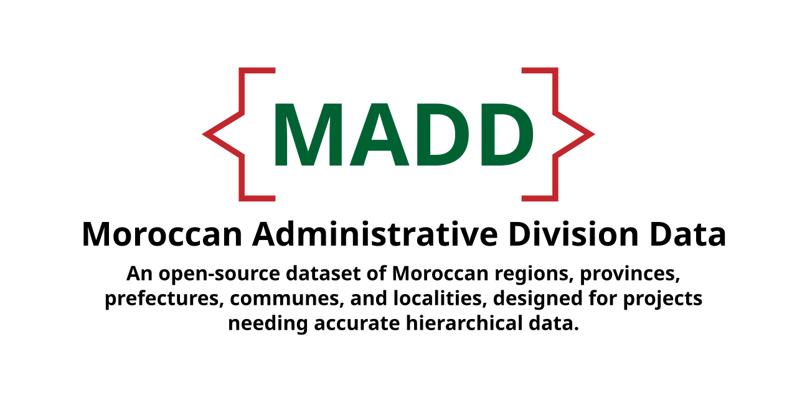

# Moroccan Administrative Division Data


A comprehensive dataset of Moroccan administrative divisions, including regions, provinces, prefectures, communes, and localities. This dataset is designed for geographic, administrative, and development projects requiring accurate and hierarchical Moroccan territorial data.

---

## Features

- **Up-to-date Data**: Based on the latest administrative divisions of Morocco (post-2015 reform).
- **Multilingual Support**: Includes translations in:
  - **Arabic (`ar`)**
  - **English (`en`)**
  - **French (`fr`)**
  - **Spanish (`es`)**
- **Scalable Structure**: Covers regions, provinces, communes, cities, and localities.
- **Simplified Hierarchy**: Focuses on the core levels to ensure simplicity and usability:
  - **Regions → Divisions → Communes → Localities**
  - This hierarchy serves as the foundational structure while leaving room for future additions such as postal codes, demographic data, or other administrative elements.

---

## Dataset Structure

The dataset is organized into hierarchical levels as JSON files:

1. **Regions (`regions.json`)**:
   - Represents the highest administrative level (e.g., Souss-Massa, Casablanca-Settat).
2. **Provinces & Prefectures (`region-divisions.json`)**:
   - Subdivisions of regions, covering rural and urban areas.
3. **Communes (`communes.json`)**:
   - The smallest administrative unit responsible for governance and public services.
4. **Localities (`localities.json`)**:
   - Neighborhoods, douars, and other informal settlements within communes.

---

## Usage

You can use this dataset in various applications:

- **Download the Data**: Clone the repository:
  ```bash
  git clone https://github.com/mahdiboughrous/moroccan-administrative-division-data.git
  ```
- **Integrate with Your Project**: Import the JSON files directly into your codebase for processing.

---

## Contributing

Contributions are welcome! Please see the [CONTRIBUTING.md](CONTRIBUTING.md) file for guidelines.

---

## License

This dataset is licensed under the [MIT License](LICENSE). You are free to use, modify, and distribute this dataset, provided you include attribution.

---

## Future Plans

- Add more granular data, such as postal codes and demographic information.
- Expand to include administrative boundary GIS files.
- Implement an API for querying the dataset.
- Extend beyond the current hierarchy to include additional administrative roles or structures.

---

## Important Note on Hierarchy

The current hierarchy (**Regions → Divisions → Communes → Localities**) is intentionally simplified to balance clarity and scalability. While this hierarchy provides a robust framework for most use cases, additional layers or attributes may be added in the future as necessary. This design ensures the dataset remains flexible for growth and adaptation to new requirements.

---

## Contact

For questions, suggestions, or issues, feel free to open an [issue](https://github.com/mahdiboughrous/moroccan-administrative-division-data/issues) or contact me at [mahdibough6@gmail.com](mailto:mahdibough6@gmail.com).